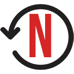

  

  <h3 align="center">Netflix Viewing Activity</h3>

  

    Download all of your Netflix account viewing activity in JSON or CSV.
     
    <a href="https://chrome.google.com/webstore/detail/netflix-viewing-activity/akcphadjbeckmkdoimhbfechbandeggg?utm_source=github"><strong>Install for Google Chrome &raquo;</strong></a>
     
     
    <a href="https://github.com/lesander/netflix-viewing-activity/archive/master.zip">Download Source</a>
    &middot;
    <a href="https://about.sander.tech">About Me</a>
    &middot;
    <a href="https://paypal.me/sanderlaarhoven">Buy me a Beer</a>
  

  
  

## Contributing
For suggestions, issues or feedback please head over to the [issue tracker](https://github.com/lesander/netflix-viewing-activity/issues) or open a [pull request](https://github.com/lesander/netflix-viewing-activity/pulls).

Contributors can easily set up a work environment as follows:
1. Clone the repository `git clone https://github.com/lesander/netflix-viewing-activity.git`
2. Open Google Chrome and navigate to `chrome://extensions`.
3. Enable Developer Mode by clicking the checkbox in the top right corner.
4. Click the 'Load unpacked extension' button and select the directory you just cloned.
5. Enable the extension and start contributing!

## License
Code and documentation copyright 2018 Sander Laarhoven. Code released under the [MIT License](https://github.com/lesander/netflix-viewing-activity/blob/master/README.md).
